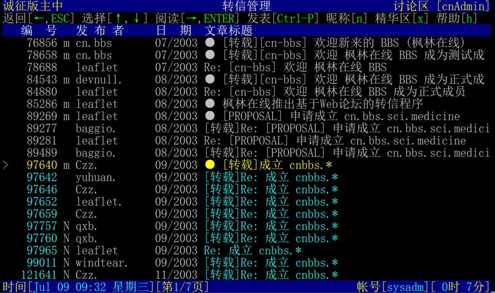

# LBBS - Classical terminal server of LeafOK BBS

中文版本的README.md位于[README.zh_CN.md](README.zh_CN.md)

Copyright (C) 2004-2025 by Leaflet  
Email : leaflet@leafok.com  
Demo site : bbs.fenglin.info (Telnet 2323 / SSH2 2322)

Introduction
=================
This software aims to providing a telnet-based interface for a pure web-based BBS [leafok_bbs](https://github.com/leafok88/leafok_bbs).  
  
  
  
  

System Requirement
==================
1) GNU C Compiler  
2) PHP ( Version >= 8.2 )  
3) MySQL database ( Version >= 8.4 )  

Installation
==================
See guide in [INSTALL.md](INSTALL.md)

