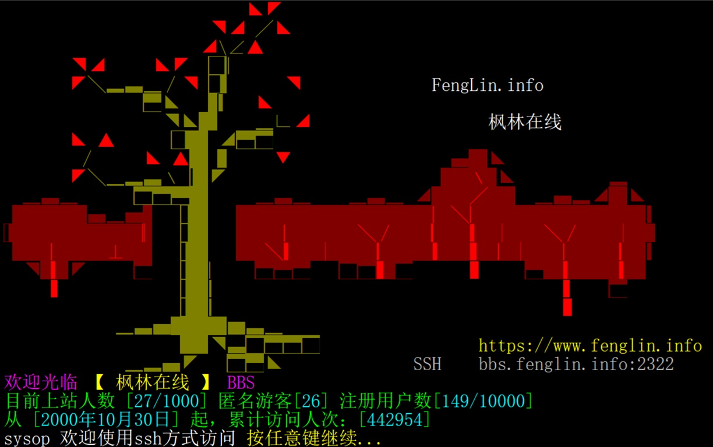

# LBBS - Classical terminal server of LeafOK BBS

中文版本的README.md位于[README.zh_CN.md](README.zh_CN.md)

Introduction
=================
This software aims to providing a telnet-based interface for a pure web-based BBS [leafok_bbs](https://github.com/leafok/leafok_bbs).  
Demo site : fenglin.info (Telnet 2323 / SSH2 2322)  
  
  
  
  

System Requirement
==================
1) GNU C Compiler  
2) PHP ( Version >= 8.2 )  
3) MySQL database ( Version >= 8.4 )  

Installation
==================
See guide in [INSTALL.md](INSTALL.md)

Copyright
=================
Copyright (C) 2004-2025 Leaflet <leaflet@leafok.com>  

License
==================
This program is free software; you can redistribute it and/or modify 
it under the terms of the [GNU General Public License](LICENSE) as published by 
the Free Software Foundation; either version 3 of the License, or    
(at your option) any later version.   
