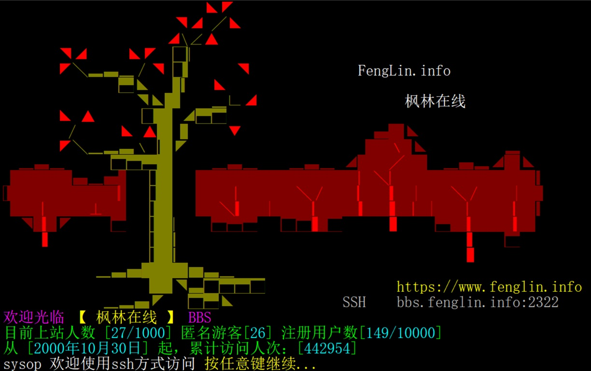
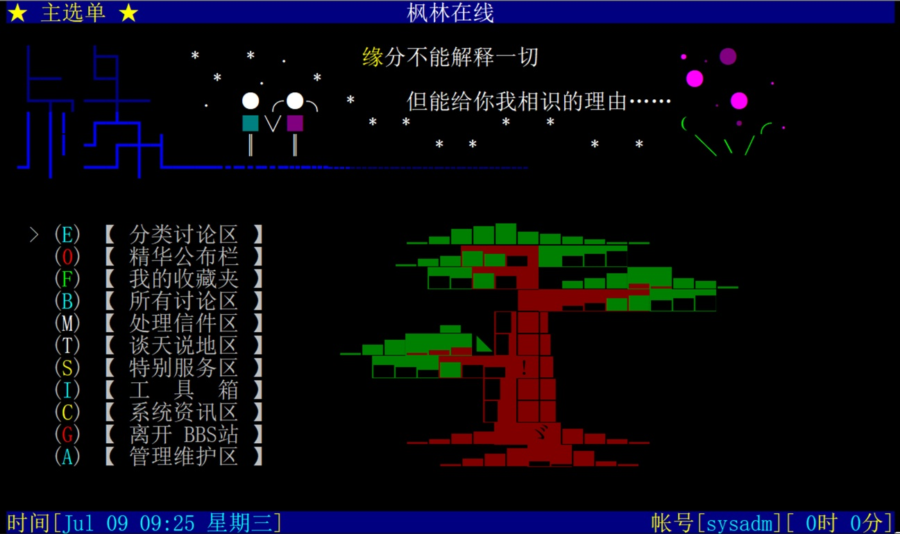
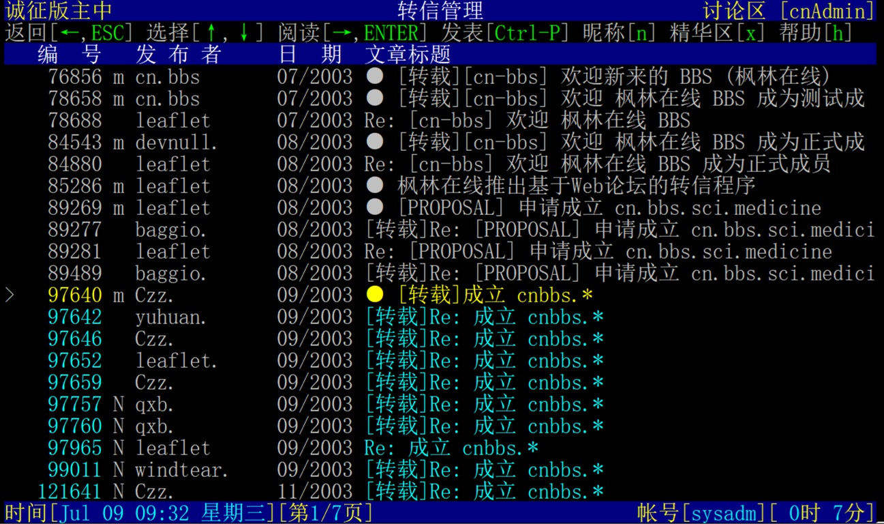
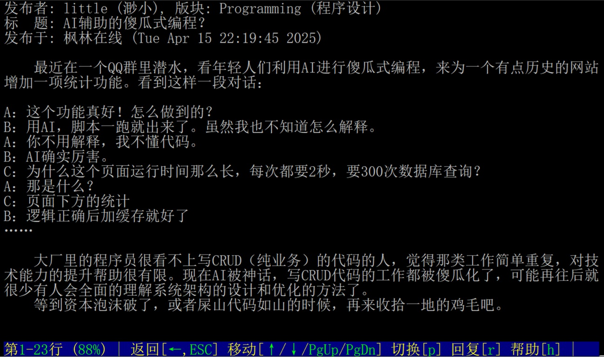

# LBBS - LeafOK BBS 的经典终端服务器

英文版本的README.md位于[README.md](README.md)

简介
=================
本软件旨在为一个纯Web访问的BBS [leafok_bbs](https://github.com/leafok/leafok_bbs) 提供基于Telnet访问的界面。  
演示站点 : fenglin.info (Telnet 2323 / SSH2 2322)  
  
  
  
  

系统需求
==================
1) GNU C 编译器  
2) PHP ( 版本 >= 8.2 )  
3) MySQL数据库 ( 版本 >= 8.4 )  

安装说明
==================
中文安装指南位于[INSTALL.zh_CN.md](INSTALL.zh_CN.md)  

教程
==================
中文演示和要点说明位于[Tutorial.zh_CN.md](Tutorial.zh_CN.md)  

版权信息
=================
版权所有 (C) 2004-2026 Leaflet <leaflet@leafok.com>  

授权许可
==================
本程序是自由软件; 你可以根据自由软件基金会发布的[GNU通用公共许可证](LICENSE)的条款重新发布和/或修改本程序，无论是许可证的第3版还是（根据你的选择）任何后续版本。
